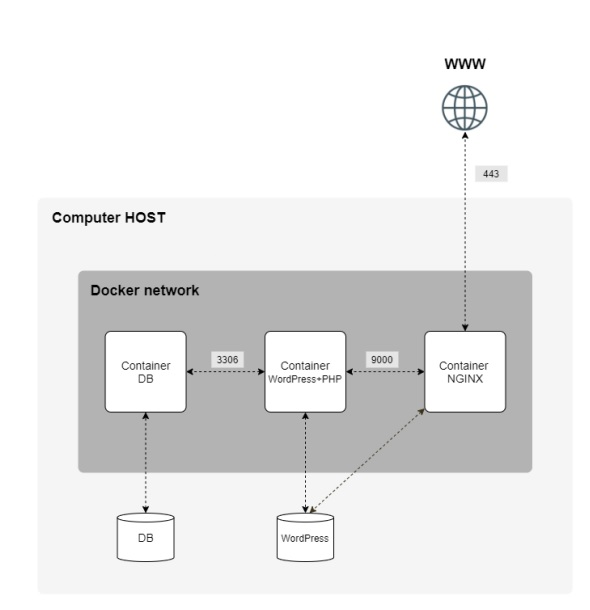

  What is it?
  -----------
  
  This project aims to broaden your knowledge of system administration by using Docker.
  You will virtualize several Docker images, creating them in your new personal virtual
  machine.
  
  Description
  -----------
  
  Simple multi-container app using lemp stack (linux + nginx + MySql + PHP)
  
  Project goals is to configure:
  - A Docker container that contains NGINX with TLSv1.2 or TLSv1.3 only.
  - A Docker container that contains WordPress + php-fpm (it must be installed and
    configured) only without nginx.
  - A Docker container that contains MariaDB only without nginx.
  - A volume that contains your WordPress database.
  - A second volume that contains your WordPress website files.
  - A docker-network that establishes the connection between your containers.
  
  #### Representation of application structure:
  
  
  
  
  Usage
  -----------
  To build and run application use:
  ```
  make build
  ```
